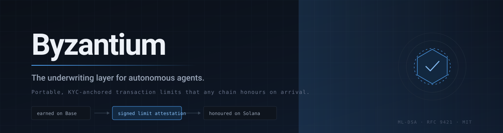
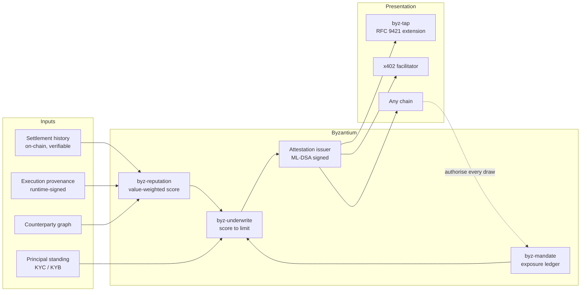
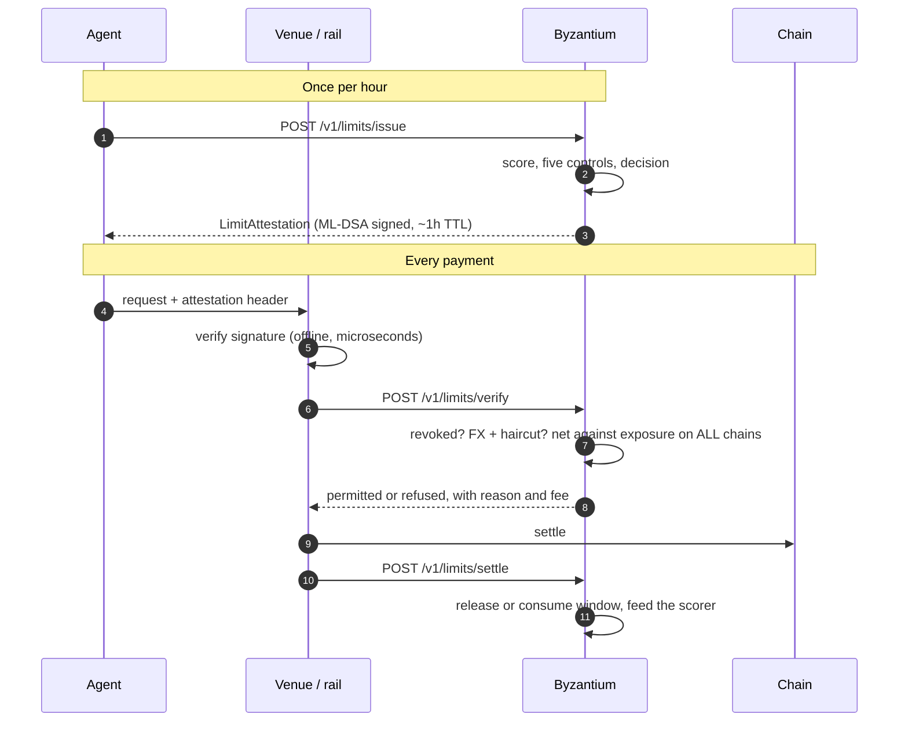
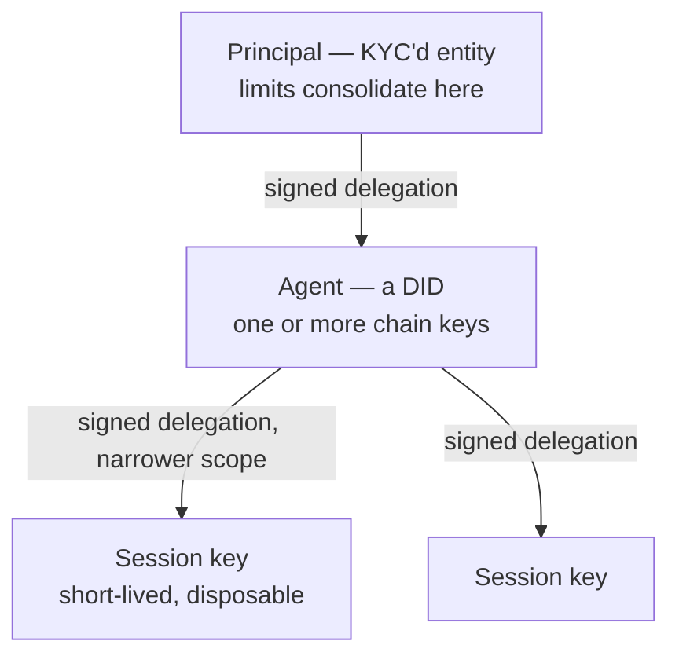

<div align="center">



<br>

[](https://github.com/likalight/Byzantium/actions/workflows/ci.yml)
[](#testing)
[](https://www.rust-lang.org)
[](LICENSE)
[-8B5CF6)](https://csrc.nist.gov/pubs/fips/204/final)
[](https://www.rfc-editor.org/rfc/rfc9421.html)
[](CONTRIBUTING.md)

**How much should an autonomous agent be allowed to spend?**

Byzantium answers that, issues the answer as a portable signed credential, and authorises every draw against it in real time.

[Try it in 60 seconds](#try-it-in-60-seconds) · [How it works](#how-it-works) · [Architecture](#architecture) · [Threat model](#threat-model) · [API](docs/api.md)

</div>

---

## Start here

AI agents are beginning to spend money on their own — buying data, paying for services, settling with other agents.

Nobody knows how much to let them spend, so everyone guesses, and everyone guesses low. An agent might handle thousands of payments flawlessly on one platform, but the moment it appears somewhere new it starts from zero. **Its track record does not travel with it.**

Byzantium is the missing layer. It works like a credit card network, and it has the same three parts:

|  | What it is | Who it is like |
|---|---|---|
| **The credential** | A signed statement of how much this agent may spend, where, and until when. Any platform can check it instantly, even one that has never seen the agent. | The card in your wallet |
| **The authorisation** | Before a payment goes through, the platform asks us whether this specific draw is allowed *right now*. | The terminal calling the network |
| **The claim record** | Tamper-evident proof of what limit was in force and what the agent actually did. | The receipt an insurer needs |

We do not hold money, move it between chains, issue credit, or run a blockchain. That is what lets platforms who compete with each other all accept the same credential from us.

> **If you only read one thing:** the credential travels with the agent, but the authorisation does not. The credential says what the ceiling is. It cannot say how much is *left*, because an agent may be drawing on three chains at once and no single venue sees the other two. Only the issuer can.

---

## Try it in 60 seconds

```bash
git clone https://github.com/likalight/Byzantium.git
cd Byzantium

# Terminal 1 — the gateway (no database needed for this)
BYZ_API_KEYS=demo-key cargo run -p byz-gateway

# Terminal 2 — a narrated walkthrough against the real API
BYZ_API_KEY=demo-key cargo run -p byz-demo
```

Or open **http://localhost:8080/demo** for the same thing in a browser.

Six acts, about ninety seconds. A new agent is refused and told exactly why. It earns standing through settled payments while its runtime signs each execution trace. The same credential is then honoured on a chain it has never touched. Four abuse attempts are pushed and refused. A failed payment produces claim evidence. The credential is revoked everywhere in under a millisecond.

<details>
<summary><b>What the output looks like</b></summary>

```
round   score   band     limit
  0        0   D3       $5000.00  ████
  1      188   D1       $7500.00  ██████
  2      277   C3      $11250.00  ██████████
  3      345   C2      $16875.00  ███████████████
  4      427   C1      $25312.50  ██████████████████████
  5      481   C1      $37968.75  ██████████████████████████████████

▸ Presenting the same limit on solana
  ✓ authorised for $3796.87 on solana
  ⏱  time to become trusted on a brand-new chain: 4 ms
```

Growth is capped per round on purpose. A flawless run still cannot reach the ceiling quickly — that is what stops a clean history being farmed and then drained in one go.

</details>

---

## How it works

### The gap this fills

Agent payments came together fast, and everything built so far is about *identity* and *movement*. Almost nothing is about *risk*.

| What exists | The question it answers |
|---|---|
| Visa TAP | Is this a real agent, or a bot pretending to be one? |
| AP2 | Did a human approve this? *(the spending cap is a number the user types)* |
| x402 | How does the money actually move? |
| ACP / UCP | How does checkout work at a merchant? |
| **— nobody —** | **How much should this agent be allowed to spend?** |

That last row is underwriting. AP2's mandate does carry a cap, but it is an **input** from the principal, not the **output** of a risk process. There is no bureau, no history, nothing that follows the agent.

### A limit is earned, not configured

Five controls. Any one can reduce or refuse, and each records a typed reason so an adverse decision is answerable.

| Control | What it does | Why it exists |
|---|---|---|
| **Standing gate** | Unverified or sanctioned principal → nothing, whatever the history | KYC opens a ceiling; it must never *earn* a limit, or the system rewards paperwork over behaviour |
| **Sublinear growth** | Standing grows with `sqrt(settled_value)` | Settling twice as much must not earn twice the limit |
| **Experience cap** | Limit ≤ `20 × largest_completed_action` | Stops a long tail of tiny clean transfers unlocking one enormous draw |
| **Rate cap** | ≤ +50% per window, or a fixed absolute step | Even a perfect run cannot jump to the ceiling |
| **Principal consolidation** | The ceiling belongs to the principal, not each agent | Splitting into ten agents divides the limit rather than multiplying it |

A brand new agent scores **zero**, not a neutral midpoint. A non-zero default is free money for anyone who can generate a keypair; the first limit comes from the verified principal instead.

> **A trap worth knowing about.** `experience_multiple × single_draw_share` must exceed 1.0 at the *lowest* band. At 10 × 10% it equals exactly 1.0, the experience cap lands on the current window, and the limit can never grow — an agent settles cleanly forever and stays on its floor. A live walkthrough caught this; [two tests](crates/byz-underwrite/src/engine.rs) now keep it caught.

### Fees fall because risk capital falls

An unproven agent needs collateral or a guarantor to transact at size. That capital has a cost. A proven agent needs less. The fee reduction is the cost of the released capital plus the reduced expected loss — **not a growth subsidy**, which would not survive contact with anyone who prices risk for a living.

---

## Architecture



### The authorisation path

This is the part most worth understanding, because it is where the design differs from a plain credential system.



Steps 3 and 4 are the whole argument. **The signature check can be done offline; the netting cannot.** A venue physically cannot see what the agent is spending elsewhere, so a shared window is only enforceable from a vantage point that observes all of them. That is also why the revenue is per authorisation rather than per document.

### Trust chain



Two properties are **enforced, not documented**:

- **History attaches to the DID, not to a key.** Rotating or revoking a key does not reset standing. Under the alternative, every rotation costs an operator their limit, and they stop rotating.
- **Delegation narrows, never widens.** A session key cannot authorise more than the agent key that issued it — and leaving a bound *unset* inherits the parent's rather than meaning unlimited. Without this the chain is decorative: an agent under a tight mandate would simply mint itself a permissive session key.

Revoking a parent implicitly revokes everything beneath it, because the chain stops resolving.

---

## For the cryptographically minded

### What is signed, and what is not

Every credential is ML-DSA (Dilithium3, [FIPS 204](https://csrc.nist.gov/pubs/fips/204/final)). The rule throughout: **a field a relying party trusts must be inside the signature.** An unsigned field is a field an attacker chooses.

The attestation signing payload covers subject, principal, issuer, tier, both limits, window, currency, the full scope (chains, asset classes, counterparty classes, actions), fee and collateral basis points, validity bounds, evidence hash, mandate hash, **and the guarantee** — so nobody can upgrade a bureau attestation to an underwritten one in transit.

Canonicalisation matters and is deliberate: `serde_json::Map` is a `BTreeMap` here, so key order is deterministic across processes, and every vector is sorted before it enters the payload. A verifier on another host rebuilds those bytes independently; a different ordering would be indistinguishable from a forgery.

```rust
// crates/byz-common/src/limits.rs
pub fn signing_payload(&self) -> ByzResult<Vec<u8>> {
    let mut chains = self.scope.chains.clone();
    chains.sort_unstable();               // order must not change the bytes
    let canonical = json!({ /* every trusted field, BTreeMap-ordered */ });
    Ok(serde_json::to_vec(&canonical)?)
}
```

### The TAP extension

[Visa's Trusted Agent Protocol](https://github.com/visa/trusted-agent-protocol) proves *who* an agent is, over RFC 9421 HTTP Message Signatures. It does not price risk. `byz-tap` implements the signature layer and adds one header:

```http
POST /checkout HTTP/1.1
Limit-Attestation: eyJzdWIiOiJkaWQ6Ynl6…
Signature-Input: sig1=("@method" "@target-uri" "limit-attestation")
                 ;created=1756713600;keyid="agent-key-1";alg="ml-dsa-65"
Signature: sig1=:MEUCIQD…:
```

**The attestation must appear in the covered components.** A limit in an unsigned header can be rewritten by anything on the network path, so [`TapVerifier`](crates/byz-tap/src/signature.rs) refuses the request rather than treating coverage as advisory. The covered list is itself signed via `@signature-params`, so it cannot be quietly shortened either.

A merchant ends up checking two signatures answering two different questions:

| Signature | Answers | Signed by |
|---|---|---|
| TAP | Did this request really come from this agent? | the agent's key |
| Attestation | Who stands behind this limit, and what is it? | the issuer's key |

### Key management

The issuer key loads from `BYZ_SIGNING_KEY_PATH` and is created on first run. Rotation keeps the previous **public** key in the verification set until everything it signed has expired — dropping it immediately would invalidate live credentials.

Verification keys are published unauthenticated at **`GET /v1/issuer-keys`**, because requiring a prior key exchange would defeat the point of a portable credential.

```bash
curl localhost:8080/v1/issuer-keys
# { "issuer": "did:web:byzantium",
#   "keys": [ { "kid": "a28b4f8f0d5f1b2c", "alg": "ml-dsa-65", "status": "active", … } ] }
```

A key file that exists but cannot be parsed **fails loudly** rather than generating a replacement, since silently rotating would invalidate every outstanding credential with no signal. Running with no path configured still works and warns; production belongs in a KMS, and [`IssuerKeystore`](crates/byz-gateway/src/keystore.rs) is shaped so that swapping the backing store touches one function.

### Privacy

The behavioural data that makes underwriting work is commercially sensitive and usually the operator's own IP. "Send us your logs" is not an integration anyone serious approves, so the system never asks.

- **Zero-knowledge identity** — an agent proves its principal cleared screening without revealing who they are (zkMe).
- **Threshold proofs, not scores** — a proof that standing exceeds a bar, without disclosing the standing. Generated off the hot path, cached, only verified inline.
- **Selective disclosure** — credentials are Merkle trees with a per-attribute blinding salt, so one attribute can be revealed while the rest stay sealed and presentations cannot be correlated.
- **Commitments, not material** — each attestation carries a hash of the evidence bundle. A dispute is settled with an inclusion proof for the specific event.

---

## Threat model

The test suite is weighted toward abuse rather than happy paths. Each of these has dedicated tests.

| Attack | Why it works elsewhere | What stops it here |
|---|---|---|
| **Bust-out** | Farm a clean history with tiny transfers, earn a ceiling, drain it, vanish. How card portfolios actually lose money. | Growth sublinear in value and capped per window; the controlled variable is exposure-at-risk, never transaction count; velocity spikes freeze increases |
| **Forged provenance** | Execution traces are the differentiated signal and the most forgeable | The **runtime** signs, not the agent. Unsigned traces are *ignored*, never partially credited — partial credit is an incentive to flood |
| **Replay** | Resubmit accepted evidence to count it twice | `(session, seq)` uniqueness, seeded from stored history so it holds across requests, not just within a batch |
| **Sybil** | Split into many agents for many limits | Limits consolidate at the principal |
| **Wash trading** | Trade with yourself to manufacture volume | Related-party counterparties earn exactly zero; concentration is discounted by Herfindahl index |
| **Credential swap** | Rewrite the limit header in transit | The limit is inside the signature; the covered-component list is itself signed |
| **Scope widening** | Mint a permissive session key | Delegation must narrow; an unset bound inherits rather than unlocks |
| **Double-spend the window** | Two concurrent draws each see an empty window | Read, decide and reserve happen under one write guard |
| **Retry double-commit** | A client retry commits exposure twice | `idempotency_key` replays the original response instead of re-deciding |

**What we do not defend against, and say so:** a compromised runtime signing key produces evidence we will believe. That is why registering one is a deliberate operational act, and why revocation is immediate.

---

## Repository layout

```
byzantium/
├── crates/
│   ├── byz-underwrite/   ★ score → limit, issuance, guarantors, revocation
│   ├── byz-reputation/   ★ value-weighted, decayed, anti-sybil scoring
│   ├── byz-provenance/   ★ runtime-signed traces, Merkle bundles
│   ├── byz-passport/     ★ principal → agent → session delegation
│   ├── byz-tap/          ★ RFC 9421 + the Limit-Attestation extension
│   ├── byz-common/         Money, limits, attestations, shared types
│   ├── byz-crypto/         ML-DSA, Kyber, Merkle trees
│   ├── byz-mandate/        enforcement engine + exposure ledger
│   ├── byz-gateway/        Axum HTTP service — keystore, hydration, routes
│   ├── byz-store/          PostgreSQL, Redis, Neo4j
│   ├── byz-identity/       DIDs, verifiable credentials, zkMe
│   ├── byz-receipt/        liability receipts and batching
│   ├── byz-anchor/         Merkle anchoring into ImmuDB
│   ├── byz-proof/          SP1 / Winterfell circuits
│   ├── byz-tee/            SGX/SEV enclave sidecars
│   ├── byz-rail-*/         EIP-3009 (Base/USDC), Solana SPL, x402, A2A
│   ├── byz-sdk/            Rust client
│   └── byz-demo/           the narrated walkthrough
├── sdk/typescript/         TS client + ProvenanceRecorder
├── migrations/             001–004
└── docs/                   API, configuration, runbooks
```

★ = the underwriting layer. The rest is the substrate it sits on.

**Where to start reading:** [`byz-underwrite/src/engine.rs`](crates/byz-underwrite/src/engine.rs) is the whole thesis in one file — the five controls, in order, each with the reason it exists. Then [`byz-common/src/limits.rs`](crates/byz-common/src/limits.rs) for what a credential actually is, and [`byz-tap/src/signature.rs`](crates/byz-tap/src/signature.rs) for the wire format.

---

## Testing

```bash
cargo test --workspace                                    # 249 tests
cargo clippy --workspace --all-targets -- -D warnings
cargo fmt --all -- --check
cargo audit                                               # see .cargo/audit.toml
```

[`crates/byz-gateway/tests/portability.rs`](crates/byz-gateway/tests/portability.rs) is the end-to-end proof: an agent earns standing on one chain and spends it on another.

Tests are named after the property they protect, so a failure reads as a sentence — `tiny_clean_volume_earns_a_tiny_score`, `a_session_key_cannot_grant_itself_more_than_the_agent_has`, `replay_across_separate_batches_is_rejected`.

---

## Documentation

| | |
|---|---|
| [API reference](docs/api.md) | Every endpoint with examples |
| [OpenAPI spec](openapi.yaml) | 29 documented paths |
| [Configuration](docs/configuration.md) | Environment variables |
| [SDKs](docs/sdks.md) | TypeScript and Rust clients, payment rails |
| [Runbooks](docs/runbooks) | Operational procedures |
| [Contributing](CONTRIBUTING.md) | Setup, conventions, review expectations |
| [Security](SECURITY.md) | Reporting, threat ranking, known risks |

---

## Design commitments

- **No token.** An underwriter whose incentives move with a token price is not a credible underwriter.
- **Post-quantum signatures throughout.** A credential underwriting real exposure should not need reissuing when the cryptography changes underneath it. *(The crate providing this is currently unmaintained — see [SECURITY.md](SECURITY.md); we would rather you heard it from us.)*
- **Privacy is structural.** Attestations carry an evidence hash, never the evidence.
- **We custody nothing.** No funds, no bridging, no wrapping, no issuance. That is the regulatory perimeter, not just design hygiene.

## Status

Working and tested, with known gaps stated plainly. Not yet running production traffic.

| Area | State |
|---|---|
| Underwriting, attestations, TAP, provenance, passport, revocation | Built and tested |
| Issuer key persistence, rotation, published verification keys | Built and tested |
| Durable state, idempotency, authorisation metrics | Built and tested |
| Shared exposure across replicas | Built — atomic check-and-reserve in Redis; refuses draws if Redis is unreachable |
| Deployment: key provisioning, demo gating | Built — `byz-keygen`, Secret mount, `/demo` off by default |
| Sanctions screening | A boolean field with no provider behind it |
| Neo4j counterparty graph | Wired but unused; scoring is in-process |
| `<200ms` latency claim | Not independently load-tested |

## License

Apache License 2.0 — see [LICENSE](LICENSE).
